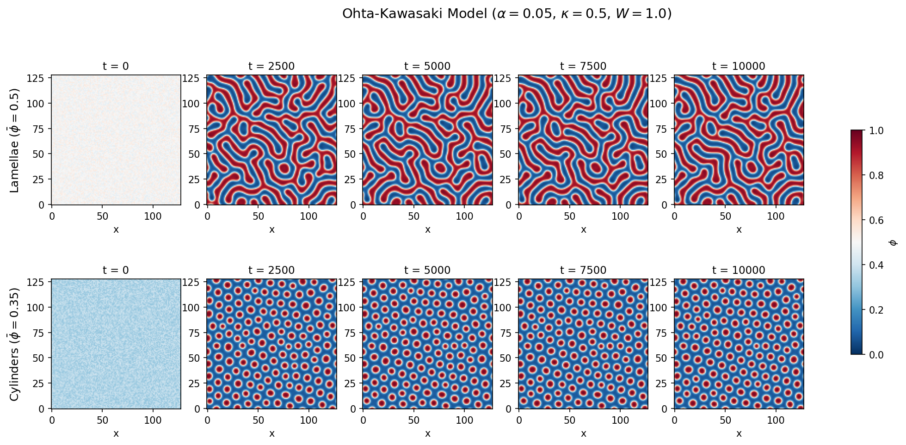

# torch-pf

A PyTorch-based phase-field simulation library for 2D/3D polymer systems.
GPU-accelerated spectral (FFT) solvers for Cahn-Hilliard and Ohta-Kawasaki equations.

<p align="center">
  
</p>

## Installation

```bash
uv sync                    # basic
uv sync --extra vis3d      # 3D isosurface rendering (scikit-image)
```

## Architecture

The library separates **thermodynamics** (what is the equilibrium) from
**kinetics** (how the system evolves) and **numerics** (how the equations
are solved):

```
Thermodynamics                      Kinetics + Numerics
──────────────                      ───────────────────
FreeEnergy (ABC)                    GridParams
├─ FloryHuggins                       shape, dx, dt
└─ DoubleWell
                                    SpectralSolver
FreeEnergyFunctional                  mobility
  local: FreeEnergy   ──────────►     functional
  kappa: float                        device
  alpha: float
```

- **`FreeEnergyFunctional`** bundles `f(φ)`, κ, and α into a single thermodynamic object.
  Set `alpha=0` for standard Cahn-Hilliard, or `alpha>0` for Ohta-Kawasaki.
- **`SpectralSolver`** handles the dynamics and numerical scheme.
  A single solver class covers both CH and OK.

## Equations

### Free energy functional

$$F[\phi] = \int \!\Big[ f(\phi) + \frac{\kappa}{2}|\nabla\phi|^2 \Big] d\mathbf{r} \;+\; \frac{\alpha}{2}\int\!\!\int G(\mathbf{r}-\mathbf{r}')(\phi-\bar\phi)(\phi'-\bar\phi)\, d\mathbf{r}\, d\mathbf{r}'$$

The first integral contains the local free energy density `f(φ)` and
the gradient energy (controlled by κ). The second integral is the
Ohta-Kawasaki long-range interaction (controlled by α; set α = 0 for
standard Cahn-Hilliard).

### Conserved dynamics (Model B)

$$\frac{\partial \phi}{\partial t} = M \nabla^2 \frac{\delta F}{\delta \phi}$$

Solved with a stabilised semi-implicit spectral scheme:

$$\hat{\phi}^{n+1} = \frac{\hat{\phi}^n - \Delta t\, M\, k^2\, \hat{g}^n}{D_k}, \qquad g^n = f'(\phi^n) - C\,\phi^n$$

where $D_k = 1 + \Delta t\, M\, k^2(C + \kappa k^2) + \Delta t\, M\, \alpha\, \mathbb{1}_{k\neq 0}$.
The stabilisation constant $C$ is automatically determined from $\max|f''|$.

### Flory-Huggins free energy

$$f(\phi) = \frac{\phi}{N_A} \ln \phi + \frac{1-\phi}{N_B} \ln(1-\phi) + \chi\,\phi(1-\phi)$$

- Critical point: $\chi_c = \frac{1}{2}\left(\frac{1}{\sqrt{N_A}} + \frac{1}{\sqrt{N_B}}\right)^2$
- The log terms are smoothly replaced by quadratic extensions for $\phi < \varepsilon$ to avoid numerical divergence.

### Double-well free energy

$$f(\phi) = W\,\phi^2(1-\phi)^2$$

## Quick start

```python
from torch_pf import FloryHuggins, FreeEnergyFunctional, GridParams, SpectralSolver, random_uniform

# Thermodynamics
fe = FloryHuggins(chi=0.1, n_a=100, n_b=100)
functional = FreeEnergyFunctional(local=fe, kappa=0.5)

# Grid + solver
grid = GridParams(shape=(128, 128), dx=1.0, dt=0.5)
solver = SpectralSolver(functional, grid, mobility=1.0)

# Run
phi0 = random_uniform(128, 128, phi_mean=0.5, noise_amplitude=0.05, seed=42)
snapshots = solver.run(phi0, n_steps=5000, save_interval=1000)
```

For block-copolymer microphase separation, just set α > 0:

```python
from torch_pf import DoubleWell, FreeEnergyFunctional, GridParams, SpectralSolver, random_uniform

functional = FreeEnergyFunctional(local=DoubleWell(W=1.0), kappa=0.5, alpha=0.3)
grid = GridParams(shape=(128, 128), dx=1.0, dt=0.5)
solver = SpectralSolver(functional, grid, mobility=1.0)
```

## Examples

| Script | Description |
|---|---|
| `examples/spinodal_decomposition.py` | 2D spinodal decomposition (Flory-Huggins) |
| `examples/spinodal_3d.py` | 3D spinodal decomposition with isosurface rendering |
| `examples/block_copolymer_2d.py` | 2D Ohta-Kawasaki: lamellae and cylinder morphologies |
| `examples/block_copolymer_3d.py` | 3D Ohta-Kawasaki: gyroid / lamellar structures |

## Project structure

```
src/torch_pf/
  free_energy.py      Free energy models + FreeEnergyFunctional
  solver.py           SpectralSolver + GridParams
  initializers.py     Initial condition generators
examples/             Example scripts
tests/                Tests
```

## Tests

```bash
uv run pytest
```
